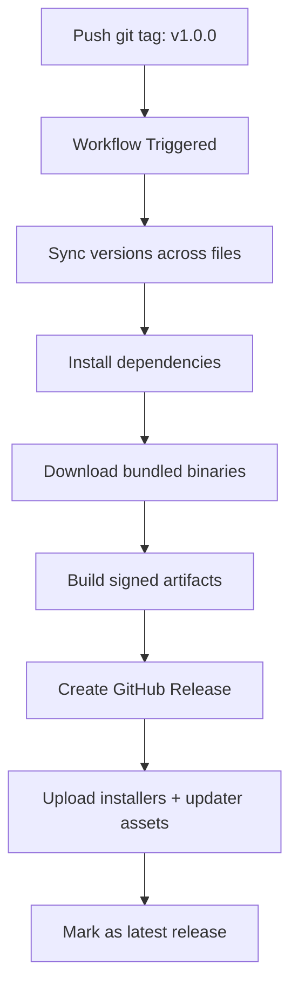

Ownstash Downloader uses a fully automated release pipeline powered by GitHub Actions. The entire process is triggered by pushing a git tag and handles version synchronization, building, signing, and publishing.

## Release Workflow Overview

The release pipeline is defined in `.github/workflows/release.yml` and follows this flow:



## Triggering a Release

### Tag Format

Releases are triggered by pushing tags in the format `vX.Y.Z` or `vX.Y.Z-beta.N`:

```yaml
on:
  push:
    tags:
      - "v*"
```

**Examples:**
- `v1.0.0` - Stable release
- `v1.0.1` - Patch release
- `v1.1.0` - Minor release
- `v2.0.0` - Major release
- `v1.0.0-beta.1` - Beta prerelease
- `v1.0.0-rc.1` - Release candidate

### Creating a Release

<Steps>
  <Step title="Update version numbers">
    Manually update the version in **all three files**:
    
    <CodeGroup>
    ```json package.json
    {
      "name": "ownstash-downloader",
      "version": "1.0.8"
    }
    ```
    
    ```toml src-tauri/Cargo.toml
    [package]
    name = "ownstash-downloader"
    version = "1.0.8"
    ```
    
    ```json src-tauri/tauri.conf.json
    {
      "productName": "Ownstash Downloader",
      "version": "1.0.8"
    }
    ```
    </CodeGroup>
    
    <Warning>
      The workflow will **verify** these match the tag. Mismatches cause build failure.
    </Warning>
  </Step>
  
  <Step title="Commit version changes">
    ```bash
    git add package.json src-tauri/Cargo.toml src-tauri/tauri.conf.json
    git commit -m "chore: bump version to 1.0.8"
    git push origin main
    ```
  </Step>
  
  <Step title="Create and push tag">
    ```bash
    git tag v1.0.8
    git push origin v1.0.8
    ```
    
    <Info>
      The workflow starts immediately after pushing the tag.
    </Info>
  </Step>
  
  <Step title="Monitor workflow">
    Watch the build progress:
    
    ```
    https://github.com/SlasshyOverhere/Ownstash-Downloader/actions
    ```
    
    The build takes approximately **15-20 minutes** to complete.
  </Step>
</Steps>

## Workflow Configuration

### Job Settings

```yaml
jobs:
  build-and-release:
    name: Build and Publish Windows Release
    runs-on: windows-latest
    timeout-minutes: 90
    env:
      CI: true
```

**Key Settings:**
- **Runner**: `windows-latest` (Windows Server 2022)
- **Timeout**: 90 minutes (safeguard against stuck builds)
- **Concurrency**: One release at a time per tag
  ```yaml
  concurrency:
    group: release-${{ github.ref }}
    cancel-in-progress: false
  ```

### Permissions

```yaml
permissions:
  contents: write  # Required to create releases and upload assets
```

## Pipeline Steps

### 1. Checkout Code

```yaml
- name: Checkout
  uses: actions/checkout@v4
  with:
    fetch-depth: 0  # Full history for git describe
```

### 2. Setup Dependencies

<Tabs>
  <Tab title="Node.js">
    ```yaml
    - name: Setup Node.js
      uses: actions/setup-node@v4
      with:
        node-version: "20"
        cache: "npm"
    ```
  </Tab>
  
  <Tab title="Rust">
    ```yaml
    - name: Setup Rust toolchain
      uses: dtolnay/rust-toolchain@stable
    
    - name: Cache Rust build dependencies
      uses: swatinem/rust-cache@v2
    ```
  </Tab>
</Tabs>

<Info>
  Caching reduces build time from ~20 minutes to ~8 minutes on subsequent builds.
</Info>

### 3. Validate Secrets

The workflow verifies required secrets are configured:

```yaml
- name: Validate required secrets
  shell: bash
  env:
    TAURI_SIGNING_PRIVATE_KEY: ${{ secrets.TAURI_SIGNING_PRIVATE_KEY }}
  run: |
    if [ -z "$TAURI_SIGNING_PRIVATE_KEY" ]; then
      echo "::error::Missing repository secret TAURI_SIGNING_PRIVATE_KEY."
      echo "::error::Generate one with: npm run tauri signer generate -- -w ~/.tauri/ownstash.key"
      exit 1
    fi
```

<Warning>
  **Required Secrets:**
  
  - `TAURI_SIGNING_PRIVATE_KEY` - Private key for signing updater artifacts
  - `TAURI_SIGNING_PRIVATE_KEY_PASSWORD` - Password for the private key (optional)
  
  See [Signing Configuration](#signing-configuration) for setup instructions.
</Warning>

### 4. Version Synchronization

A custom script ensures all version numbers match the tag:

```yaml
- name: Sync versions from tag and normalize updater endpoint
  shell: bash
  env:
    RELEASE_TAG: ${{ github.ref_name }}
    GITHUB_REPOSITORY: ${{ github.repository }}
  run: node .github/scripts/prepare-release-from-tag.mjs
```

This script:
- Extracts version from tag (e.g., `v1.0.8` → `1.0.8`)
- Updates `package.json`, `Cargo.toml`, `tauri.conf.json`
- Normalizes updater endpoint URL

### 5. Version Verification

```yaml
- name: Verify synchronized versions
  shell: bash
  env:
    RELEASE_TAG: ${{ github.ref_name }}
  run: |
    VERSION="${RELEASE_TAG#v}"
    PACKAGE_VERSION="$(node -e "console.log(JSON.parse(require('fs').readFileSync('package.json','utf8')).version)")"
    TAURI_VERSION="$(node -e "console.log(JSON.parse(require('fs').readFileSync('src-tauri/tauri.conf.json','utf8')).version)")"
    CARGO_VERSION="$(awk -F'\"' '/^version = / { print $2; exit }' src-tauri/Cargo.toml)"
    
    echo "Tag version      : $VERSION"
    echo "package.json     : $PACKAGE_VERSION"
    echo "tauri.conf.json  : $TAURI_VERSION"
    echo "Cargo.toml       : $CARGO_VERSION"
    
    [ "$PACKAGE_VERSION" = "$VERSION" ]
    [ "$TAURI_VERSION" = "$VERSION" ]
    [ "$CARGO_VERSION" = "$VERSION" ]
```

If any version doesn't match, the build **fails**.

### 6. Install Dependencies

```yaml
- name: Install dependencies
  run: npm ci --legacy-peer-deps
```

<Note>
  `npm ci` is used instead of `npm install` for reproducible builds from `package-lock.json`.
</Note>

### 7. Download Bundled Binaries

```yaml
- name: Ensure bundled binaries are available
  shell: pwsh
  working-directory: src-tauri
  run: |
    if (Test-Path "./download-binaries.ps1") {
      powershell -ExecutionPolicy Bypass -File ./download-binaries.ps1
    } else {
      Write-Host "download-binaries.ps1 not found; assuming binaries are already present."
    }
```

Downloads:
- `yt-dlp.exe`
- `spotdl.exe`
- `ffmpeg.exe`
- `ffprobe.exe`

### 8. Build and Publish

The main build step using the official Tauri Action:

```yaml
- name: Build and publish GitHub release
  uses: tauri-apps/tauri-action@v0
  env:
    GITHUB_TOKEN: ${{ secrets.GITHUB_TOKEN }}
    TAURI_SIGNING_PRIVATE_KEY: ${{ secrets.TAURI_SIGNING_PRIVATE_KEY }}
    TAURI_SIGNING_PRIVATE_KEY_PASSWORD: ${{ secrets.TAURI_SIGNING_PRIVATE_KEY_PASSWORD }}
  with:
    tagName: ${{ github.ref_name }}
    releaseName: Ownstash Downloader ${{ github.ref_name }}
    releaseBody: |
      ## Automated Release
      - Built from tag `${{ github.ref_name }}`
      - Uses synchronized app versions across package.json, Cargo.toml, and tauri.conf.json
      - Includes signed updater assets and `latest.json`
      - Windows installer and updater bundles are attached below
      - Stable latest installer URL: `https://github.com/${{ github.repository }}/releases/latest/download/ownstash-downloader-windows-x64-setup.exe`
    generateReleaseNotes: true
    releaseDraft: false
    prerelease: ${{ contains(github.ref_name, '-') }}
    includeUpdaterJson: true
    updaterJsonPreferNsis: true
    assetNamePattern: ownstash-downloader-windows-x64[setup][ext]
    retryAttempts: 2
```

**Key Parameters:**

| Parameter                | Value                        | Description                                      |
|--------------------------|------------------------------|--------------------------------------------------|
| `tagName`                | `${{ github.ref_name }}`     | Git tag (e.g., `v1.0.8`)                         |
| `releaseName`            | `Ownstash Downloader v1.0.8` | Display name in GitHub Releases                  |
| `generateReleaseNotes`   | `true`                       | Auto-generate from commit messages               |
| `releaseDraft`           | `false`                      | Publish immediately (not draft)                  |
| `prerelease`             | `contains(tag, '-')`         | Mark as prerelease if tag contains hyphen        |
| `includeUpdaterJson`     | `true`                       | Generate `latest.json` for auto-updater          |
| `updaterJsonPreferNsis`  | `true`                       | Prefer NSIS installer in updater manifest        |

### 9. Mark as Latest

For stable releases (no `-` in tag), mark as the latest release:

```yaml
- name: Mark release as latest
  if: ${{ !contains(github.ref_name, '-') }}
  uses: actions/github-script@v7
  with:
    script: |
      const { owner, repo } = context.repo;
      const tag = context.ref.replace("refs/tags/", "");
      const release = await github.rest.repos.getReleaseByTag({ owner, repo, tag });
      await github.request("PATCH /repos/{owner}/{repo}/releases/{release_id}", {
        owner,
        repo,
        release_id: release.data.id,
        make_latest: "true"
      });
```

This ensures `/releases/latest` always points to the newest stable version.

## Release Artifacts

Each successful build produces the following assets:

### Installers

| File                                         | Type          | Size    | Purpose                      |
|----------------------------------------------|---------------|---------|------------------------------|
| `ownstash-downloader-windows-x64-setup.exe`  | NSIS Installer| ~150 MB | Primary Windows installer    |
| `ownstash-downloader-windows-x64.msi`        | MSI Installer | ~120 MB | Alternative Windows installer|

### Updater Assets

| File                                                  | Type              | Size   | Purpose                        |
|-------------------------------------------------------|-------------------|--------|--------------------------------|
| `ownstash-downloader-windows-x64-setup.nsis.zip`      | Update Archive    | ~80 MB | In-app update package          |
| `ownstash-downloader-windows-x64-setup.nsis.zip.sig`  | Signature         | &lt;1 KB  | Cryptographic signature        |
| `latest.json`                                         | Update Manifest   | &lt;1 KB  | Version + download URLs        |

### Update Manifest Structure

```json latest.json
{
  "version": "1.0.8",
  "notes": "Automated Release\n- Built from tag v1.0.8\n...",
  "pub_date": "2024-03-03T12:34:56Z",
  "platforms": {
    "windows-x86_64": {
      "signature": "dW50cnVzdGVkIGNvbW1lbnQ6IHNpZ25hdHVyZSBmcm9tIHRhdXJpIHNlY3JldCBrZXkK...",
      "url": "https://github.com/SlasshyOverhere/Ownstash-Downloader/releases/download/v1.0.8/ownstash-downloader-windows-x64-setup.nsis.zip"
    }
  }
}
```

This manifest is consumed by Tauri's auto-updater to check for and download updates.

## Signing Configuration

### Generating Signing Keys

One-time setup to create signing keys:

```bash
# Install Tauri CLI if not already installed
npm install -g @tauri-apps/cli

# Generate key pair
npm run tauri signer generate -- -w ~/.tauri/ownstash.key
```

**Output:**
```
Your keypair was generated successfully
Private: /Users/you/.tauri/ownstash.key (Keep this secret!)
Public: dW50cnVzdGVkIGNvbW1lbnQ6IG1pbmlzaWduIHB1YmxpYyBrZXk6IDU0NzZBMTkzNzYzQzlCQTQK...

Add the public key to tauri.conf.json:
```

### Adding Secrets to GitHub

<Steps>
  <Step title="Navigate to repository secrets">
    Go to:
    ```
    https://github.com/YOUR_USERNAME/Ownstash-Downloader/settings/secrets/actions
    ```
  </Step>
  
  <Step title="Add TAURI_SIGNING_PRIVATE_KEY">
    - Click "New repository secret"
    - Name: `TAURI_SIGNING_PRIVATE_KEY`
    - Value: Contents of `~/.tauri/ownstash.key` file
    - Click "Add secret"
  </Step>
  
  <Step title="Add TAURI_SIGNING_PRIVATE_KEY_PASSWORD (optional)">
    Only needed if you set a password during key generation.
    
    - Name: `TAURI_SIGNING_PRIVATE_KEY_PASSWORD`
    - Value: Your password
  </Step>
  
  <Step title="Update tauri.conf.json">
    Add the public key to your config:
    
    ```json src-tauri/tauri.conf.json
    {
      "plugins": {
        "updater": {
          "pubkey": "dW50cnVzdGVkIGNvbW1lbnQ6IG1pbmlzaWduIHB1YmxpYyBrZXk6IDU0NzZBMTkzNzYzQzlCQTQK...",
          "endpoints": [
            "https://github.com/SlasshyOverhere/Ownstash-Downloader/releases/latest/download/latest.json"
          ]
        }
      }
    }
    ```
    
    Commit and push this change.
  </Step>
</Steps>

<Warning>
  **Security:**
  
  - ❌ Never commit the private key to git
  - ❌ Never share the private key publicly
  - ✅ Store it securely in GitHub Secrets
  - ✅ Keep a backup in a secure location
</Warning>

## Stable Release URLs

The GitHub Releases page provides stable URLs that always point to the latest version:

```
https://github.com/SlasshyOverhere/Ownstash-Downloader/releases/latest/download/ownstash-downloader-windows-x64-setup.exe
https://github.com/SlasshyOverhere/Ownstash-Downloader/releases/latest/download/latest.json
```

These URLs:
- ✅ Always redirect to the newest stable release
- ✅ Can be used in documentation and websites
- ✅ Are used by the auto-updater
- ❌ Don't include prerelease versions (beta, rc, etc.)

## Debugging Failed Builds

### Common Issues

<AccordionGroup>
  <Accordion title="Version mismatch error">
    **Error:**
    ```
    package.json : 1.0.7
    tauri.conf.json : 1.0.8
    Error: Process completed with exit code 1.
    ```
    
    **Solution:**
    
    Update all three files to match:
    - `package.json` → `"version": "1.0.8"`
    - `src-tauri/Cargo.toml` → `version = "1.0.8"`
    - `src-tauri/tauri.conf.json` → `"version": "1.0.8"`
  </Accordion>
  
  <Accordion title="Missing TAURI_SIGNING_PRIVATE_KEY">
    **Error:**
    ```
    ::error::Missing repository secret TAURI_SIGNING_PRIVATE_KEY.
    ```
    
    **Solution:**
    
    Follow [Signing Configuration](#signing-configuration) to generate and add the key.
  </Accordion>
  
  <Accordion title="Binary download failures">
    **Error:**
    ```
    Error downloading SpotDL: The remote name could not be resolved
    ```
    
    **Solution:**
    
    This is usually transient. Re-run the workflow or check if GitHub/download servers are accessible.
  </Accordion>
  
  <Accordion title="Rust compilation timeout">
    **Error:**
    ```
    Error: The operation was canceled.
    ```
    
    **Solution:**
    
    The build exceeded 90 minutes. This is rare but can happen if:
    - GitHub runners are slow
    - Rust cache is corrupted
    
    Re-run the workflow. Consider increasing `timeout-minutes` if persistent.
  </Accordion>
</AccordionGroup>

### Viewing Build Logs

1. Go to [Actions tab](https://github.com/SlasshyOverhere/Ownstash-Downloader/actions)
2. Click on the failed workflow run
3. Click on the "Build and Publish Windows Release" job
4. Expand individual steps to see detailed logs

**Key logs to check:**
- "Verify synchronized versions" - Version mismatch issues
- "Ensure bundled binaries are available" - Download failures
- "Build and publish GitHub release" - Compilation errors

## Auto-Updater Integration

The released artifacts enable in-app updates via Tauri's updater plugin.

### How It Works

<Steps>
  <Step title="App checks for updates">
    On startup or manually, the app fetches:
    ```
    https://github.com/SlasshyOverhere/Ownstash-Downloader/releases/latest/download/latest.json
    ```
  </Step>
  
  <Step title="Compare versions">
    ```rust
    let current_version = "1.0.7";
    let latest_version = update_manifest.version; // "1.0.8"
    
    if latest_version > current_version {
        // Update available!
    }
    ```
  </Step>
  
  <Step title="Verify signature">
    The app verifies the download signature using the public key in `tauri.conf.json`:
    
    ```rust
    verify_signature(download, signature, public_key)?;
    ```
    
    This prevents malicious updates.
  </Step>
  
  <Step title="Download and install">
    The updater:
    - Downloads the `.nsis.zip` file
    - Extracts the installer
    - Prompts user to install
    - Relaunches app after installation
  </Step>
</Steps>

### Frontend Implementation

See `src-tauri/src/updater.rs` for backend implementation:

```typescript
import { check } from '@tauri-apps/plugin-updater';
import { ask } from '@tauri-apps/plugin-dialog';

async function checkForUpdates() {
  const update = await check();
  
  if (update?.available) {
    const yes = await ask(
      `Update to ${update.version} is available. Install now?`,
      { title: 'Update Available', kind: 'info' }
    );
    
    if (yes) {
      await update.downloadAndInstall();
      // App will relaunch
    }
  }
}
```

## Next Steps

<CardGroup cols={2}>
  <Card title="Building from Source" icon="hammer" href="/advanced/building-from-source">
    Learn how to build locally before releasing
  </Card>
  
  <Card title="Architecture" icon="sitemap" href="/advanced/architecture">
    Understand the system architecture
  </Card>
  
  <Card title="Contributing" icon="code-pull-request" href="https://github.com/SlasshyOverhere/Ownstash-Downloader/blob/main/CONTRIBUTING.md">
    Guidelines for contributing code
  </Card>
  
  <Card title="GitHub Actions Docs" icon="book" href="https://docs.github.com/en/actions">
    Learn more about GitHub Actions
  </Card>
</CardGroup>